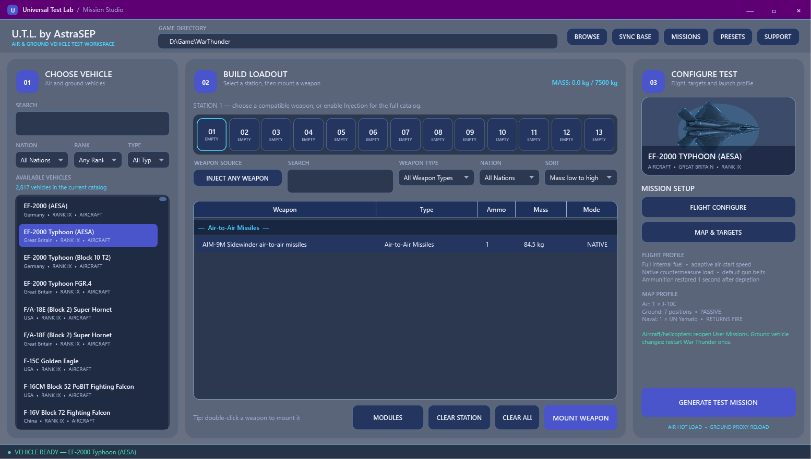

# Universal Test Lab

> **Public beta — v0.12.0-beta.5**

Universal Test Lab creates local War Thunder User Missions for testing aircraft, helicopters, drones, ground vehicles, custom loadouts, and targets.



## Features

- Aircraft, helicopter, drone, and playable ground-vehicle test missions.
- Nation, rank, and vehicle-type filters.
- Custom loadouts with native weapons and optional experimental weapon injection.
- Research modules, fuel, gun belts, countermeasures, shells, mobility, maps, targets, and reusable presets.
- Custom ground sights from War Thunder `UserSights` folders.
- Optional solo combined-battles sandbox on 48 Domination map layouts, with side selection, native ground/air/helicopter spawns, and the original A/B/C and team-spawn markers on the tactical map.
- Rapid target recovery, unlimited player respawns, and one-second rearming after ammunition is depleted.

## Installation

1. Download the latest `Universal_Test_Lab` ZIP from [Releases](https://github.com/VanillaWong/Universal-Test-Lab-Vanilla-Version/releases) and extract it.
2. Run `UniversalTestLab.exe` and select the War Thunder root folder.
3. Select **Sync Base**, configure a vehicle, and generate the mission.
4. In War Thunder, close and reopen **User Missions**, then launch the current **HOT UTL** mission.

After changing the playable ground vehicle, restart War Thunder once so the game reloads the generated ground proxy.

The executable is not digitally signed, so Windows SmartScreen may show a warning.

## Controls and refresh

- After regenerating a mission, close and reopen the **User Missions** window. A full game restart is not required unless the playable ground vehicle changed.
- Helicopters use bindings from the **Helicopter controls** section for firing, switching secondary weapons, and releasing countermeasures.
- When using a custom ground sight, press **Alt+F9** once inside the mission to reload `UserSights`.

## Known beta limitations

- **Combined Battles — Domination** currently creates a solo sandbox, not a complete Domination match: it uses the selected map and spawn and shows the native capture/spawn locations for orientation, but intentionally adds no AI units, active capture logic, score, or match progression.
- Native weapons are the most reliable. Injected weapons may require systems that the selected vehicle does not provide, such as a compatible seeker, radar, data link, targeting pod, HUD integration, or visual model.
- Modern player tanks use a reserve `userVehicles` proxy. Generated projectiles retain their configured behavior, but the HUD icon, ammunition card, or kill feed may identify them as M74.
- Some research-only ground systems, including the Black Night laser rangefinder, may not initialize through the proxy.

## Generated files and removal

Universal Test Lab creates files only in the following locations:

- `UserMissions\Universal Test Lab\`
- `content\pkg_user\levels\Clean_Testdrive.*`
- Generated `utl_*` flight models, loadouts, countermeasure belts, and weapon adapters under `content\pkg_user\gameData\`
- `content\pkg_local\gameData\units\tankModels\userVehicles\us_m2a4.blk`
- `content\pkg_local\gameData\Weapons\groundModels_weapons\utl_ground\`
- `%LOCALAPPDATA%\UniversalTestLab\`

When a custom ground sight is used, the application can also create `UserSights\us_m2a4\`, update the `us_m2a4` entry in `global.blk`, and save `global.blk.universal-test-lab-backup`.

To remove the generated content:

1. Close Universal Test Lab and War Thunder.
2. Delete only the UTL paths listed above. Do not delete the complete `content\pkg_user`, `content\pkg_local`, `UserSights`, or `Saves` folders.
3. Delete `%LOCALAPPDATA%\UniversalTestLab\` to remove the saved game path and presets.
4. Delete `UserSights\us_m2a4\` only if it contains `.universal-test-lab-generated`. Remove its entry from `global.blk` manually if necessary.

## Inspiration

Universal Test Lab was created by AstraSEP and is now maintained by [VanillaWong](https://github.com/VanillaWong), inspired by GUI and custom-mission projects shared by the War Thunder community and YouTube channels such as Ask3lad. Those creators are not contributors to this project.

## Building

Requirements: Windows, .NET Framework 4.x, and PowerShell.

```powershell
.\Build.ps1 -SelfTest
```

The compiled application is written to `dist\UniversalTestLab.exe`.

`Build-CombinedMaps.ps1` rebuilds `data\combined_maps.tsv` from an extracted War Thunder `mis.vromfs.bin` mission tree. It resolves the realistic briefing's A/B/C coordinates plus the native two-sided ground, aircraft, and helicopter spawns. Only maps with a complete two-sided spawn set are included.

## Contributing

Bug reports and feature proposals are welcome through [GitHub Issues](https://github.com/VanillaWong/Universal-Test-Lab-Vanilla-Version/issues). See [CONTRIBUTING.md](CONTRIBUTING.md) and [SECURITY.md](SECURITY.md).

## Legal

Universal Test Lab is an independent fan-made project and is not affiliated with or endorsed by Gaijin Entertainment.

The application embeds [`wt_ext_cli`](https://github.com/Warthunder-Open-Source-Foundation/wt_ext_cli) under the Apache License 2.0. See [THIRD_PARTY_NOTICES.md](THIRD_PARTY_NOTICES.md). Project source is available under the [MIT License](LICENSE).
